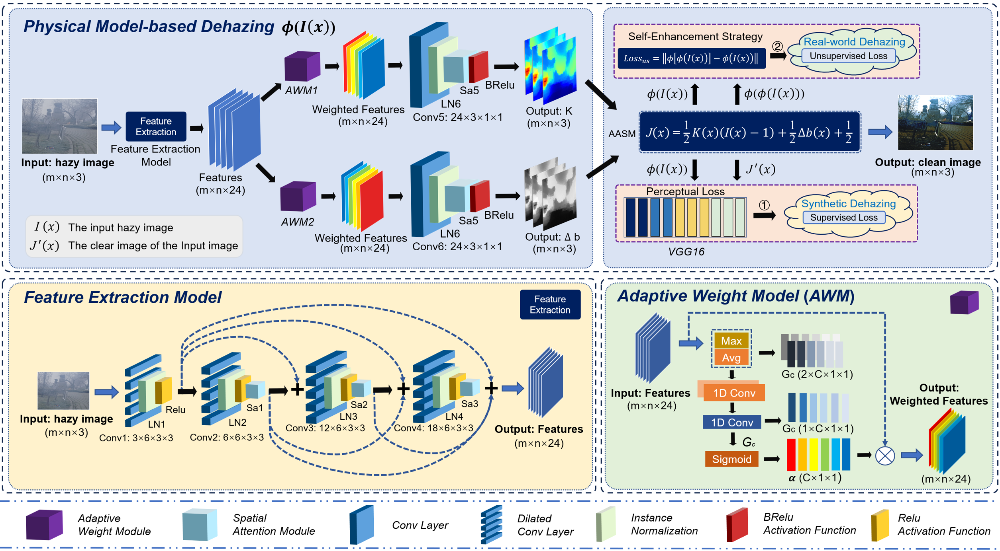
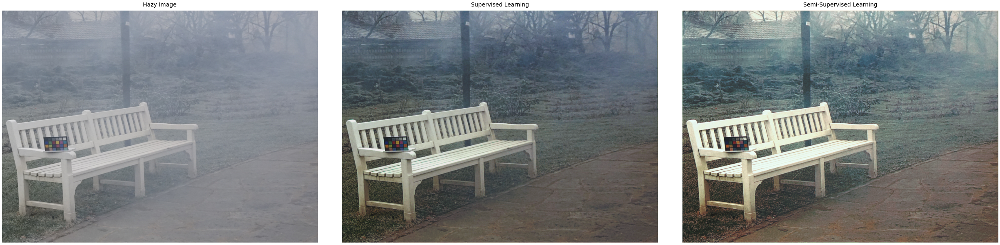

## Towards Real-world Image Dehazing via Adaptive Atmospheric Scattering Model

Xudong Wang, Xi’ai Chen, Weihong Ren, Zhi Han, Yandong Tang  
  

## Our work 

We propose a semi-supervised image dehazing algorithm with better adaptability in real-world environments. To better suit the actual situation of light inhomogeneity, we proposed a physical image dehazing model with adaptive information correction by combining the global atmospheric light value and transmittance matrix. Meanwhile, by sharing the feature extraction network, a light-weight CNN with only 31kb space occupation is designed to estimate the parameter matrix in an efficient way. The proposed algorithm uses a semi-supervised learning strategy to make full use of synthetic dataset while enhancing the dehazing ability in real-world through an online enhancement learning strategy.

  &emsp;&emsp; 

## Dependencies
* Python 3.8
* PyTorch 1.8.1 + cu111
* torchvision 0.9.1 + cu111
* numpy
* opencv-python
* skimage
* hiddenlayer
* matplotlib
* PIL
* math
* os
## Architecture
model.py: The definition of the model class.

utils.py: Some tools for network training and testing.

data.py: Preparation tools for the training dataset.

test.py: Quick dehazing test for hazy images.

testall.py: Dehazing test for all hazy images dataset.

train.py: Training the dehazing model by supervised learning.

SemiStrain.py: Training the dehazing model by Semi-supervised learning in specific dataset.

## Test
1. Please put the images to be tested into the ``test_images`` folder. We have prepared the images of the experimental results in the paper.
2. Please run the ``test.py``, then you will get the following results:

  &emsp;&emsp; 

## Test all
If you want to test the results on a labeled dataset such as [O-HAZE](https://data.vision.ee.ethz.ch/cvl/ntire18//o-haze/) , you can go through the following procedure:
1. Please put the dataset to be tested into the ``test0`` folder. You need put the hazy images into the ``test0/hazy`` folder, and put the clear images into the ``test0/gt`` folder. We have prepared the dataset of the experimental results in the paper.
2. Please run the ``testall.py``, then you will get the dehazing results SSIM, PSNR, and Inference time.

## Train
You can perform supervised learning of the network by following this step.
1. Please put the dataset into the ``train_data`` folder. You can get the [RESIDE](https://sites.google.com/view/reside-dehaze-datasets) for training.
2. Please run the ``train.py``, then you will get the dehazing model in ``saved_models`` folder.

## Semi-supervised Train
You can perform semi-supervised learning of the network by following this step.
1. Please make sure you have got the supervised learning trained model.
2. Please put the specific dataset into the ``Sdata/gt_hazy`` folder, which does not require any image with labels. 
3. Please run the ``SemiStrain.py``, then you will get the Semi-supervised learning dehazing model in ``saved_models`` folder.

## · Other modules will be updated after publication.
